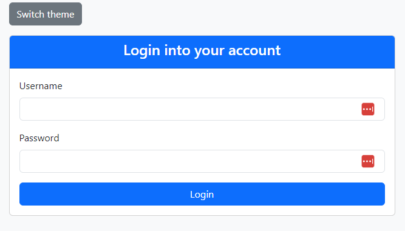
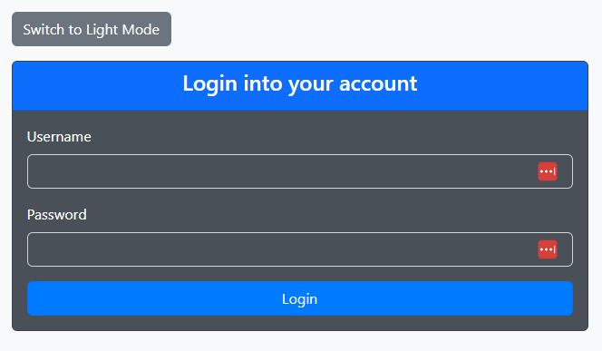
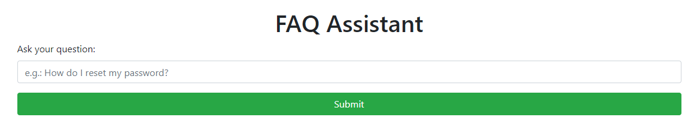
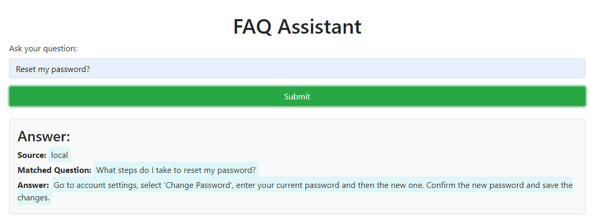
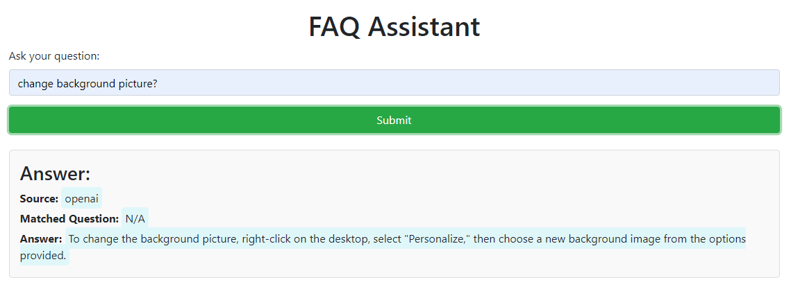
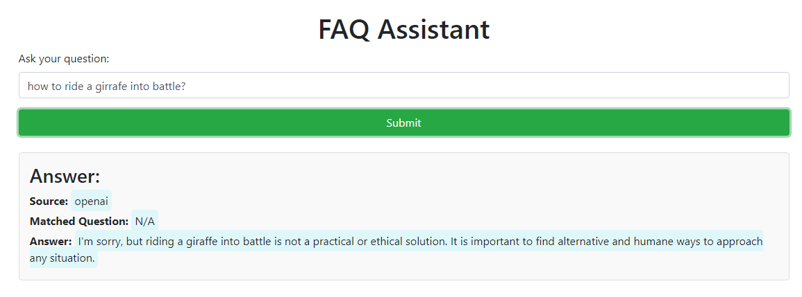
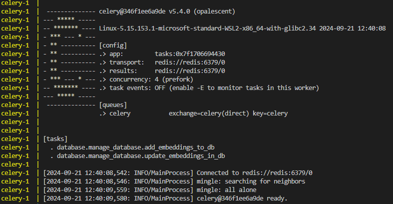
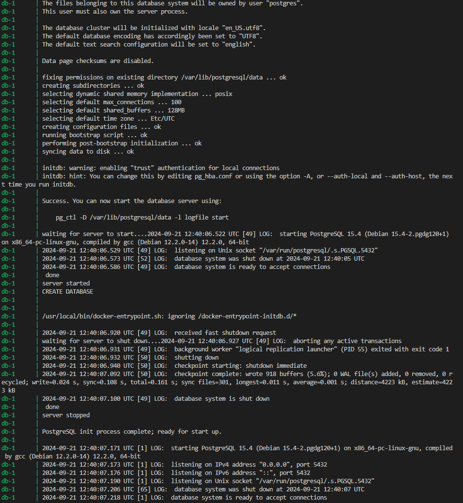

# Contextual FAQ Assistant


## Important disclaimer!!
If you want to run the app, you **MUST** define the environment variables inside the .env.example. After that, you can rename it to _.env_ and simply run _docker-compose up --build_ and it _should_ :) work with no issues.
One thing I haven't quite get past is that the app address is _localhost:8080_, and not Docker's _0.0.0.0:8080_. From what I understood, it makes the app listen for connections from any IP address, handling requests from the host machine.

## Short presentation
This simple application implements an assistant for frequently asked user questions regarding IT support or account management.
It uses a Postgres database to store and retrieve embeddings of a series of provided questions and answers, and also updates the embeddings during usage, in order to enhance the responses accuracy and duration.

A simple HTML page handles the login and authentication of the user (for testing purposes, I've used the _username_ "user" and the _password_ "test"); should this app be used in a production environment, **MUCH** better user management and password best practices need to be implemented.



I've tried to implement a full dark mode switcher, but I only managed to change the login card theme. You can understand then that I'm not a Web developer, nor that I try to become one.



After the user is logged in, he can start question the assistant with IT questions. A LangChain RunnableBranch is used to differentiate IT from NON-IT questions, but something stops it from being **extremely accurate**, as much prompt engineering and template instructions I've implemented.



It can answer IT questions pretty well, as seen from the following screenshot, as it detects that a question should be answered using the local database:



It can also prompt the OpenAI model when it doesn't retrieve a close enough embedding:



But it can fail to completely refuse to respond to non IT-related questions (still something that I have to look into), even though the LangChain... ugh.. chain should deal with these kind of questions.




## Project structure

The project has the following structure and now follows FastAPI guidelines:

```bash
contextual_faq_assistant/
│
├── app/
│   ├── auth/
│   │   ├── __init__.py
│   │   ├── auth_utils.py         # Authentication logic utility methods
│   │
│   ├── core/
│   │   ├── __init__.py
│   │   ├── celery_app.py         # Celery configuration
│   │   ├── config.py             # Pydantic settings
│   │   ├── handlers.py           # The FastAPI error handler
│   │   ├── lifespan.py           # The FastAPI lifespan definition
│   │   ├── templates.py          # The Jinja2 templates definition
│   │
│   ├── database/
│   │   ├── __init__.py
│   │   ├── base.py               # Database engine and session management
│   │   ├── create_database.py    # Database creation
│   │   ├── manage_collections.py # Read, Update, Delete for collections
│   │   ├── manage_database.py    # Read, Update, Delete for embeddings
│   │   ├── models.py             # The SQLAlchemy ORM models definition
│   │
│   ├── routers/
│   │   ├── __init__.py
│   │   ├── auth.py               # FastAPI routes for authentication
│   │   ├── collections.py        # FastAPI routes for collections management
│   │   ├── questions.py          # FastAPI routes for question page and responses
│   │
│   ├── schemas/
│   │   ├── __init__.py
│   │   ├── collection_schema.py  # Pydantic model for collections
│   │   ├── error_schema.py       # Pydantic model for errors detail
│   │   ├── question_schema.py    # Pydantic model for questions and responses
│   │   ├── token_schema.py       # Pydantic model for token representation and token data
│   │
│   ├── services/
│   │   ├── __init__.py
│   │   ├── embeddings_service.py # The Embeddings model
│   │   ├── llm_service.py        # The LangChain chain and OpenAI model
│   │
│   ├── templates/
│   │   ├── login.html            # Serves the login page
│   │   ├── question.html         # Serves the QA page
│   │
│   ├── utils/
│   │   ├── __init__.py
│   │   ├── FAQ_database.json     # Provided FAQ database
│   │   ├── faq_utils.py          # Utility functions for reading the provided FAQ
│   │   ├── utils.py              # Different utility functions
│   │
│   ├── __init__.py
│   ├── dependencies.py           # FastAPI dependencies module
│   ├── main.py                   # Entry point for the app
│
├── screenshots/                  # Screenshots for this file
│── .env.example                  # Environment variables file, set it and rename to .env
├── docker-compose.yml            # Defines the Docker services
├── Dockerfile                    # The Docker image
├── README.md
├── requirements.txt              # The project's package requirements
```

When it comes to the folder structure, I've tried to keep it as logical and clean as possible. Hopefully I don't need to go into too much detail here, having named each module and folder as descriptive as possible.

1. The **auth** folder contains the utility module which deals with token creation and verification to let the user access the assistant.

2. The **core** folder contains the core functionalities, like the Celery app, Pydantic settings configuration, FastAPI error handler, the app's lifespan and the Jinja2 FastAPI HTML templates.
The __celery_app.py__ module defines the _Celery_ app and configures it. Having used it only for adding and updating embeddings asynchronously, it only autodiscovers the those tasks. I've used Redis as the backend message broker. It's also my first time using that, so I've learned something new :)



3. The **database** folder deals with everything about the _PostgreSQL_ database, used for _info and embedding storage_. Since I've only wanted to create the PoC for such a complex app, I've only used the database for this, and not for user data storage (username, password, email etc.) Of course, this should be done in a production environment, but I think it will suffice for this assignment. I would personally used a vector database, like _Chroma_ or _Pinecone_ for the embeddings, but since we would also need to retrieve the answer, I understand the choice (even though the metadata of one of those options would work too, I think). The scripts included in this folder are responsible for:

    3.1 A base module dealing with defining the database engine and its session, tied to SQLAlchemy.
    
    3.2 Creating the initial _database_ and setting up the tables for storing the questions, their embeddings, their answers and the collection for each question.

    3.3 Managing the _collections_, should this is desired. I didn't used this module, since I only dealt with a single collection, but should more be needed, the implementation is there.

    3.4 Managing the _database_, selecting the desired embeddings, inserting into the desired table with the corresponding values, updating values and potentially deleting embeddings and their data

    3.5 The SQLAlchemy models for table definition.
    


4. The **schemas** folders defines the schemas used for questions, collections, errors and token, Pydantic style (just like FastAPI likes it).

5. The **services** folder is responsible with:

    5.1. Creating the embedding model, which also computes the embedding of a question  / prompt. It's implemented as a _singleton_ to avoid multiple initialization, it uses _caching_ to avoid multiple calls to the API, and it also _limits the token length_ for lengthy questions, using the _tiktoken_ tokenizer.

    5.2 Creating the OpenAI responder, implemented with a _LangChain RunnableBranch_, which theoretically deals with questions regarding IT or account management and refusing to respond to unrelated questions. As much as I tried, I didn't managed to completely make it refuse answering to such kind of questions, but the implementation is done according to the official documentation. I've even added the LangChain recommended implementation, which suggests using a route function instead of a now considered Legacy RunnableBranch. I'm happy that I created a helpful IT assistant, but I'm a bit sad that it's **WAY** too helpful.

6. The **templates** folder simply defines the _login.html_ page, used for user authentication and _question.html_ which is used throughout the application uptime. A lot of time went debugging this part, part of it being because of my lack of working with token authentication and part of it representing the passing of the token from the login page to the _ask-question_ FastAPI route. It was fun though, and I learned a lot.

7. Finally, the **utils** folder defines the _FAQ_database.json_ with the provided questions, the _faq_utils.py_ module for loading and handling the provided database, and the _utils.py_ module, defining the utility functions. I hope the methods are descriptive enough for me not to go into details here.

8. The _dependencies.py_ module defines the FastAPI routes dependencies, in this case the _get_token_ one, since this is **mandatory** if a user wants to use the assistant.

9. The _main.py_ module is used for the FastAPI app, which first initializes the database, and stores the initial FAQ embeddings, deals with the token authentication and also serves the question answering route. I hope the comments and method descriptions are fully describing the intent behind every one of them.

10. I've also used a _docker-compose.yml_ file to define the services used for the application, as well as the postgres volume used for storing the embeddings. It is highly dependent on the _.env_ file, which defines many environment variables, including the OpenAI API key and model params, celery backend, database authentication and the secret key used for token generation.

11. There is a _Dockerfile_ too, used for running the app as a Docker image, in conjunction with the _docker-compose.yml_ file. It uses the _python:3.8-slim_ image as base, it copies the necessary files, installs the requirements, correctly uses a non-root user (since celery can complain about it) and runs the main uvicorn app on port 8080.


## Things that can be improved
Of course, I'm not going to "get drunk with cold water", as we Romanians like to say. It is not a perfect app, from many points:
- As I said, I'm not storing user data in a separate database, or even separate collections of questions per user. I presume this would be needed in a real-life scenario.
- There is a possibility that if the Docker container is stopped, and the last page loaded was the QA one, if the user restarts the app, that token authentication is bypassed (could be tested, if the browser _localStorage_ is emptied)
- I probably haven't correctly defined all the FastAPI routes, being my first time working with it, but I've learned a lot about it.
- A vector database could have been used for the embeddings, since for similarity search, **ALL** embeddings are retrieved and the cosine similarity is used for getting the most similar embedding and the answer.
- Probably the embeddings are not that qualitative, since I've used the small text-embeddings OpenAI app. There is a probability that the dimensions are not enough to capture the full semantic meaning with this model.
- Even though I've added highly descriptive comments for the majority (if not all) scripts and their methods, maybe they aren't that descriptive for an untrained eye.
- A much better job could have been done on the HTML / CSS / JS side, I've only managed that thanks to ChatGPT and Claude :)
- The Celery configuration could be enhanced, by adding task namespacing, and even task serializer or time limits. I've only used configuration that I understood for now, but it sounds very interesting.


## Conclusion
I've implemented a **contextual FAQ assistant**, capable of either selecting the most appropiate response from a local database, based on a similarity score or prompt an online LLM for the answer. I've added authentication using **FastAPI's dependency mechanism**, **PostgreSQL** for storing and retrieving embeddings and their answers, **LangChain's RunnableBranch** for answering / refusing to answer (this part still needs some work, we'll put it into backlog), **Dockerfile** and **docker-compose.yml** for running it as a Docker image and **Celery** for async embeddings adding and updating.
As external assistants, I've used **ChatGPT** (it's really great with the newest _memory_ feature), **Claude** (which sometimes is annoying with its way too formal way of responding, as if he would cry with me too when I'm getting an error) and **Amazon's Q** for code completion (it's really great, it shortened the development time a lot!).
Regardless of the final answer, I'm very _proud_ of what I've achieved, having learned a lot, being exposed to a lot of (new and old) technologies and being motivated to do it.

## LE Updates!
1. Switched to an in-database similarity search, which makes use of pgvector's functionality for vector cosine operation. For more info, check the newly added `search_for_similarity_in_db` method inside `app/database/manage_database.py` module. It makes use of `pgvector`'s `<=>` operator to compute embeddings and sorts them descendingly.

```sql
SELECT content, answer, 1 - (embedding <=> %s::vector) AS similarity
    FROM embeddings
    WHERE collection = %s
    ORDER BY similarity DESC
    LIMIT 1;
```

This should help in case the local database becomes quite large.

2. Working on some improvements:
* following the FastAPI structure, which is recommended here: https://fastapi.tiangolo.com/tutorial/bigger-applications/. **[DONE]**
* better management of env variables through a setup such as: https://fastapi.tiangolo.com/advanced/settings/ **[DONE]**
* SQLAlchemy for managing DB resources in an ORM approach **[DONE]**
* schemas moved in a separate module and not in the main API logic (main.py) **[DONE]**
* endpoint output schemas to be used and objects directly from the DB served (in this particular example) **[partially DONE]** --> Some routes need a `response_class` rather than a model